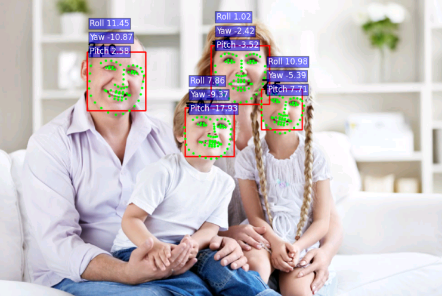
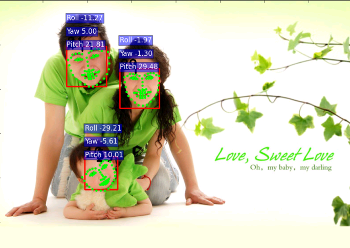
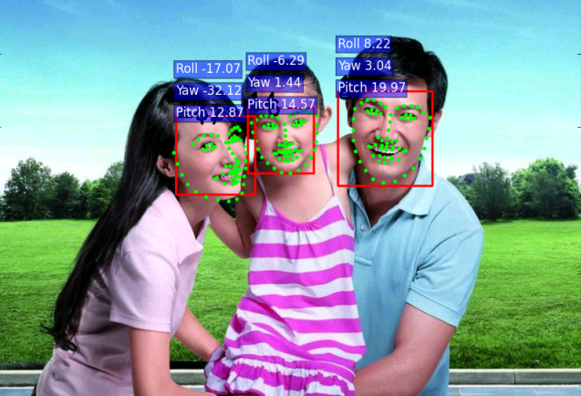

# face-landmark-localization
This is a project predict face landmarks (68 points) and head pose (3d pose, yaw,roll,pitch).

## Install
- [caffe](https://github.com/BVLC/caffe)
- [dlib face detector](http://dlib.net/)

you can down [dlib18.17](http://pan.baidu.com/s/1gey9Wd1) 

cd your dlib folder

cd python_example

./compile_dlib_python_module.bat

 add dlib.so to the python path

if using dlib18.18, you can follow the [official instruction](http://dlib.net/)
- opencv

## Usage

- Command : python landmarkPredict.py predictImage  testList.txt

(testList.txt is a file contain the path of the images.)

## Model

- You can download the pre-trained model from [here](http://pan.baidu.com/s/1mhf274c) 

## Result

